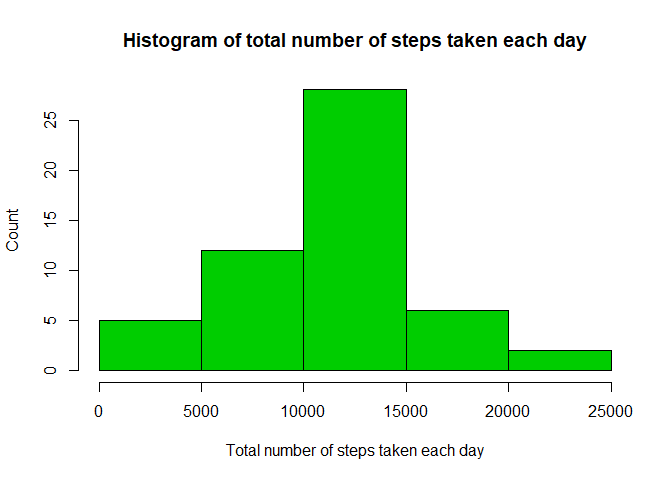

###Reading data 

```r
library(knitr)
library(ggplot2)
library(dplyr)
```

```
## 
## Attaching package: 'dplyr'
```

```
## The following objects are masked from 'package:stats':
## 
##     filter, lag
```

```
## The following objects are masked from 'package:base':
## 
##     intersect, setdiff, setequal, union
```

```r
readdata <- read.csv("C:\\Users\\Mahe\\Desktop\\Data Science\\Reproducible-research\\project1\\activity.csv")
readdata1 <- readdata[!is.na(readdata$steps) ,]
head(readdata1)
```

```
##     steps       date interval
## 289     0 2012-10-02        0
## 290     0 2012-10-02        5
## 291     0 2012-10-02       10
## 292     0 2012-10-02       15
## 293     0 2012-10-02       20
## 294     0 2012-10-02       25
```

###Histogram of the total number of steps taken each day

```r
readdata1$date <- as.Date(readdata1$date)
sum_steps <- readdata1 %>% group_by(date) %>% summarise(total_sum = sum(steps))
sum_steps
```

```
## # A tibble: 53 x 2
##    date       total_sum
##    <date>         <int>
##  1 2012-10-02       126
##  2 2012-10-03     11352
##  3 2012-10-04     12116
##  4 2012-10-05     13294
##  5 2012-10-06     15420
##  6 2012-10-07     11015
##  7 2012-10-09     12811
##  8 2012-10-10      9900
##  9 2012-10-11     10304
## 10 2012-10-12     17382
## # ... with 43 more rows
```

```r
plot_1 <- hist(sum_steps$total_sum , col = "green" , xlab = "Total no of steps taken each day" , main = "Histogram of total no of steps taken each day")
```

<!-- -->

```r
plot_1
```

```
## $breaks
## [1]     0  5000 10000 15000 20000 25000
## 
## $counts
## [1]  5 12 28  6  2
## 
## $density
## [1] 1.886792e-05 4.528302e-05 1.056604e-04 2.264151e-05 7.547170e-06
## 
## $mids
## [1]  2500  7500 12500 17500 22500
## 
## $xname
## [1] "sum_steps$total_sum"
## 
## $equidist
## [1] TRUE
## 
## attr(,"class")
## [1] "histogram"
```

###Mean and median number of steps taken each day

```r
mean_of_step_taken = mean(readdata1$steps)
mean_of_step_taken
```

```
## [1] 37.3826
```

```r
median_of_step_taken = median(readdata1$steps)
median_of_step_taken
```

```
## [1] 0
```

###Time series plot of the average number of steps taken


```r
avg_steps = readdata1 %>% group_by(interval) %>% summarise(avg_steps = mean(steps))

plot(avg_steps$interval, avg_steps$avg_steps , type = "l" , xlab = "Intervals" , ylab = "average steps")
```

<!-- -->

###The 5-minute interval that, on average, contains the maximum number of steps

```r
max_interval = avg_steps$interval[which.max(avg_steps$avg_steps)]
max_interval
```

```
## [1] 835
```

### we use mean of interval to replace na value of a particular interval

```r
n <- nrow(readdata)

for(i in 1:n)
{
    
    if(is.na(readdata$steps[i])){
      c <- which(readdata$interval[i] == avg_steps$interval )
      readdata$steps[i] <- avg_steps[c,]$avg_steps
    }
}

head(readdata$steps)
```

```
## [1] 1.7169811 0.3396226 0.1320755 0.1509434 0.0754717 2.0943396
```
###Histogram of the total number of steps taken each day after missing values are imputed

```r
sum_steps <- readdata1 %>% group_by(date) %>% summarise(total_sum = sum(steps))
hist(sum_steps$total_sum, 
     xlab="Total number of steps taken each day", 
     ylab="Count", 
     main="Histogram of total number of steps taken each day",
     col=3)
```

<!-- -->

###Panel plot comparing the average number of steps taken per 5-minute interval across weekdays and weekends

```r
  library(lubridate)
```

```
## 
## Attaching package: 'lubridate'
```

```
## The following object is masked from 'package:base':
## 
##     date
```

```r
  readdata$date <- as.Date(readdata$date)
  readdata2 <- readdata
  readdata2$daytype <- "Weekday"
  readdata2$day <- wday(readdata$date , label = T)
  
  for(i in 1:n){
      if(readdata2$day[i] %in% c("Sat" , "Sun")){
      readdata2$daytype[i] <- "weekend"
    }
  }
  daytype_sum <- readdata2 %>% group_by(daytype , interval) %>% summarize(total_sum = mean(steps))
  
  qplot(interval, total_sum, data= daytype_sum,
      type="l",
      geom="line",
      xlab="Interval",
      ylab="Number of Steps (Average)",
      main="Average steps taken Weekends vs. Weekdays",
      facets =daytype ~ .) 
```

```
## Warning: Ignoring unknown parameters: type
```

<!-- -->


